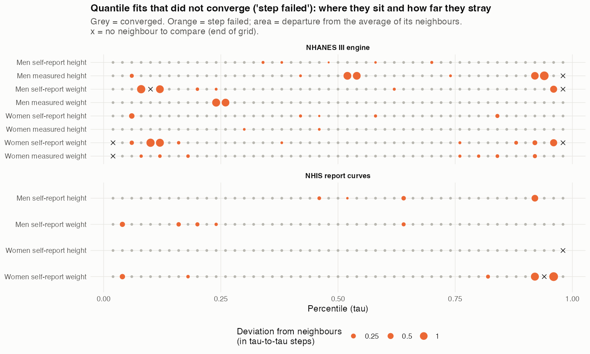
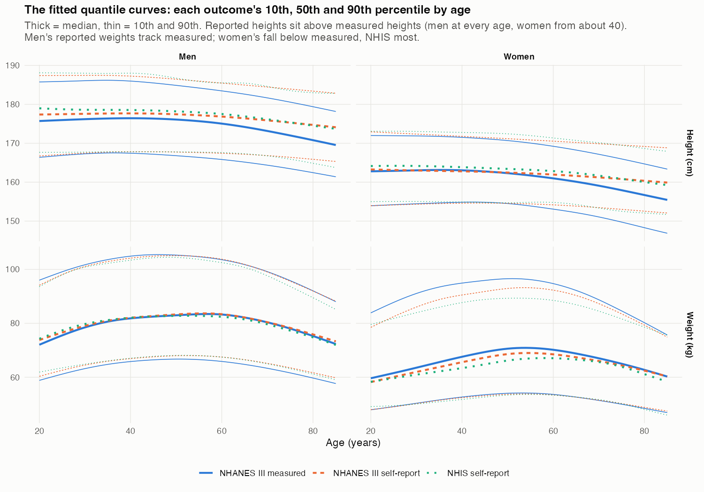
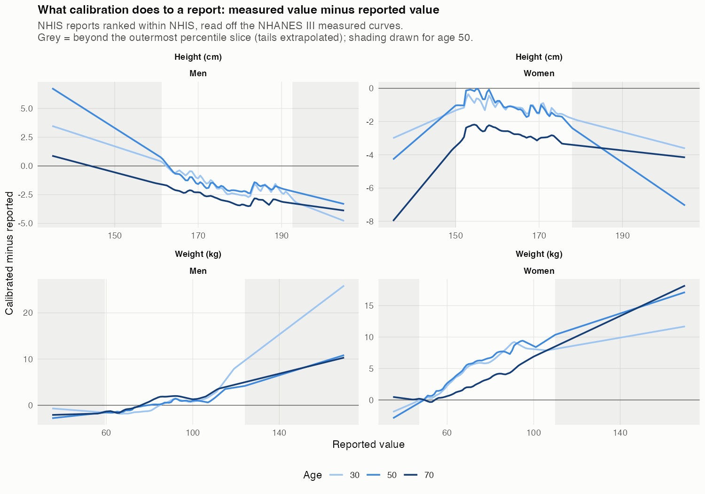
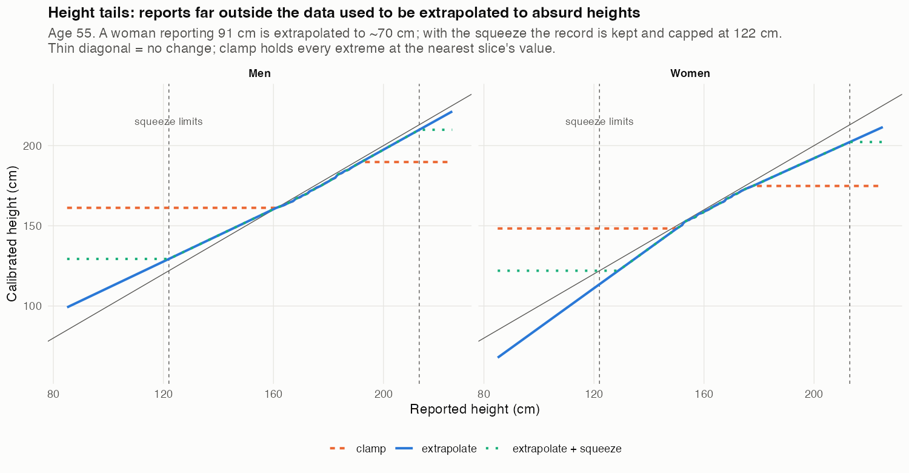
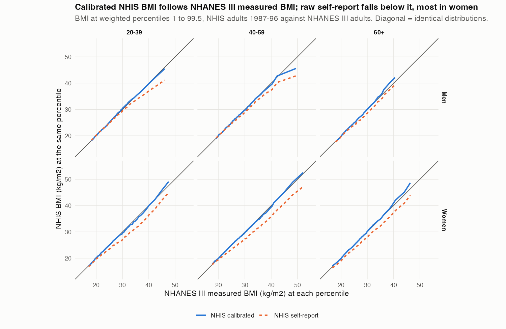

```{r setup, include=FALSE}
knitr::opts_chunk$set(collapse = TRUE, comment = "#>", message = FALSE, warning = FALSE)
library(mepsCalibrate)
# qgam prints progress lines for every fitted quantile; keep the vignette readable
quiet <- function(expr) { invisible(utils::capture.output(r <- suppressMessages(suppressWarnings(expr)))); r }
tab <- function(x, ...) knitr::kable(x, ..., row.names = FALSE)
```

## The problem

The National Health Interview Survey (NHIS) records how tall and heavy people say they are. It
does not measure them. The Third National Health and Nutrition Examination Survey (NHANES III,
1988-1994) records both: people were asked, and then they were measured. Self-reports are
biased in a way that depends on the person's height, weight and age, so any analysis of NHIS
that uses height, weight or body mass index (BMI) starts from the wrong values. Heavier people
report lighter weights, and the upper tail of BMI, where the mortality risk lives, is
compressed. In the NHIS 1987-1996 adults used below, self-reported BMI puts about 18% of
women aged 40-59 in the obese range. The same women measured in NHANES III are 30% obese.

This vignette describes how `mepsCalibrate` corrects for that, what the correction did to
the full NHIS 1987-1996 adult cohort, and what the checks do and do not show.

## Why not a simple regression

The standard correction regresses measured values on reported ones in NHANES and applies the
fitted equation to NHIS. That assumes a person who reports 70 kg in NHIS weighs the same, on
average, as a person who reports 70 kg in NHANES. Courtemanche, Pinkston and Stewart (2014)
show this fails across surveys: NHANES respondents know they are about to be weighed, while
respondents to an ordinary interview do not, so the same true weight gets reported
differently. Keith and colleagues (2011) add that the error in self-reported BMI is not
recoverable from the reported value by regression, and that such corrections can make
classification worse for the groups that matter most.

Courtemanche and colleagues' alternative needs a much weaker assumption. It uses each report's
**percentile rank within its own survey** and asks only that, within a survey, a higher report
means a higher expected true value. Two surveys of the same population should have the same
distribution of true values. So a person at the 80th percentile of NHIS reports is matched to
the 80th percentile of NHANES III *measured* values, whatever the two surveys' reporting habits
were. `mepsCalibrate` implements this with smooth quantile curves, so that age can enter as a
continuous variable and no age cells go thin.

## The method

1. **Fit quantile curves in NHANES III** for measured and for self-reported height and weight,
   for each sex, as smooth functions of age (`fit_calibration_curves()`). All taus on a grid, for
   example 0.02 to 0.98 in steps of 0.02, are fitted together with `qgam::mqgam()`.
   Fitted quantiles are sorted across tau so they cannot cross.
2. **Fit quantile curves of the target survey's own reports** (`fit_survey_report_curves()`),
   again smooth in age.
3. **Rank each report in its own survey.** Find where the person's report falls on the
   target survey's report curve for their sex and age, by linear interpolation between
   adjacent tau slices. Reports rounded to whole inches or pounds take the mid-rank over the
   rounding interval.
4. **Read the NHANES III measured curve at that rank** (`apply_continuous_calibration()`).
5. **Treat the tails separately.** Beyond the outermost tau slice a rank can't be read, so a rule is
   needed (`tail = "clamp"`, `"extrapolate"` or `"exponential"`). The exponential rule models
   both tails as exponential: ranks matched between two exponential tails give a linear map from
   the edge value whose slope is the ratio of the two tails' exponential scales.
6. **Squeeze, do not exclude.** Extreme values are capped at limits (`squeeze = list(height_cm =
   c(122, 213), bmi = c(12, 80))`) and flagged, and the record is kept. Excluding a record
   turns it into a missing value, which biases the sample, and the extremes are often real.
   Among NHIS adults in 1987-1996, people with BMI below 12 had about 3.4 times, and those
   with BMI of 60 to 80 about 4.1 times, the deaths expected for their age, sex and year.

A second approach, `fit_conditional_mapping()`, regresses measured values directly on the
report and age. It has lower individual error but shrinks the spread of values. It is
described at the end.

## A small simulation you can run

Two surveys sample the same population. Survey A has measurements and reports. Survey B has
only reports, and its respondents under-report more. Because this is a simulation we also know
survey B's true values, so we can see whether each method recovers them.

```{r simulate}
set.seed(2026)
make_people <- function(n) {
  age <- runif(n, 20, 80)
  data.frame(age = age,
             ht = rnorm(n, 176 - 0.1 * (age - 20), 7),                   # cm
             wt = exp(rnorm(n, log(80) + 0.002 * (age - 50), 0.22)))      # kg, right skewed
}
A <- make_people(1500); B <- make_people(6000)       # same population, different samples

# survey A: reports 1 cm too tall and 2% too light; survey B: 2.5 cm too tall and 7% too light
ref <- data.frame(HSAGEIR = A$age, HSSEX = "1", SDPPHASE = 1, BMXHT = A$ht, BMXWT = A$wt,
                  self_reported_height_cm = A$ht + 1 + rnorm(nrow(A), 0, 1),
                  self_reported_weight_kg = A$wt * 0.98 + rnorm(nrow(A), 0, 1))
target <- data.frame(SEX = "1", AGE = B$age,
                     Ht_m = (B$ht + 2.5 + rnorm(nrow(B), 0, 1.5)) / 100,
                     BMXWT = B$wt * 0.93 + rnorm(nrow(B), 0, 1.5))
true_bmi <- B$wt / (B$ht / 100)^2
```

Fit the NHANES-like engine and the target's own report curves, then calibrate three ways:
ranking the reports against survey A's report curves (the assumption that both surveys report
alike), ranking them in survey B itself, and the second with extreme values squeezed.

```{r fit}
taus <- seq(0.1, 0.9, by = 0.1)
eng <- quiet(fit_calibration_curves(ref, tau = taus))
sc  <- quiet(fit_survey_report_curves(target, tau = taus))

lim <- list(height_cm = c(122, 213), bmi = c(12, 80))
a_rank <- apply_continuous_calibration(target, eng, tail = "exponential", squeeze = lim)
b_rank <- apply_continuous_calibration(target, eng, survey_curves = sc, tail = "exponential", squeeze = lim)
```

```{r compare, echo=FALSE}
raw_bmi <- target$BMXWT / target$Ht_m^2
sumry <- function(x) c(mean = mean(x), median = median(x), p90 = unname(quantile(x, 0.90)), p99 = unname(quantile(x, 0.99)))
out <- rbind(`true (unknown in practice)` = sumry(true_bmi),
             `reported` = sumry(raw_bmi),
             `ranked against survey A's reports` = sumry(a_rank$calibrated_bmi),
             `ranked within survey B` = sumry(b_rank$calibrated_bmi))
kl <- vapply(list(raw_bmi, a_rank$calibrated_bmi, b_rank$calibrated_bmi),
             function(y) distribution_divergence(true_bmi, y)$kl, numeric(1))
out <- cbind(round(out, 1), `KL from true` = c(NA, round(kl, 4)))
knitr::kable(out, caption = "BMI in survey B: reported and calibrated against the truth. KL is the Kullback-Leibler divergence from the true distribution, in nats.")
```

Ranking against survey A's report curves leaves survey B's extra under-reporting in place,
because it treats B's respondents as if they reported like A's. Ranking within B recovers the
true distribution. That is the point of using the target survey's own ranks. The squeeze matters
only for absurd values:

```{r squeeze}
odd <- data.frame(SEX = "1", AGE = 55, Ht_m = c(0.91, 1.75, 2.6), BMXWT = c(86, 80, 90))
res <- apply_continuous_calibration(odd, eng, survey_curves = sc, tail = "exponential", squeeze = lim)
res[, c("Ht_m", "BMXWT", "calibrated_height_m", "calibrated_weight_kg", "calibrated_bmi", "calibrated_squeezed")]
```

The two absurd heights (91 cm and 2.6 m) are capped and flagged. The ordinary record is
calibrated normally. No record is dropped.

## The real analysis: NHIS 1987-1996 against NHANES III

Everything below was computed from the NHIS extract (IPUMS NHIS, 1987-1996) and the NHANES III
examination, interview and linked-mortality files. Those data and the roughly ten minutes of
engine fitting cannot be redone inside a vignette, so the tables and figures here are stored
results. The scripts that produced them are listed at the end.

### What was fitted

The NHANES III engine used the 7,500 to 8,600 adults of each sex with unsubstituted measured
values, weighted by the examination weight. The NHIS curves used a random 40,000 adults of each
sex, weighted by the person weight. Both used 49 taus, 0.02 to 0.98.

```{r cohort}
tab(read.csv("results/cohort_counts.csv"), format.args = list(big.mark = ","),
    col.names = c("NHIS cohort", "Records"))
```

Each tau is a separate fitted curve, and `mgcv` reported "step failed" for some of them.

```{r convergence}
cv <- read.csv("results/convergence.csv")
tab(cv, col.names = c("Fitted set", "Outcome", "Quantile fits", "Step failed"))
```

That is 65 of 588 fits (11%). Comparing each failed fit with the average of its neighbours,
most are harmless, with a median departure of one tenth of a tau-to-tau step, but 11 of the 57
that could be checked depart by more than one step. They concentrate in the weight tails
(taus 0.92 to 0.98 and 0.08 to 0.12), so the tails of the weight curves are the least reliable
part of the engine.

```{r fig4, echo=FALSE, out.width="100%", fig.cap="Quantile fits that did not converge, and how far each strays from its neighbours."}

```

### The fitted curves and the correction

```{r fig1, echo=FALSE, out.width="100%", fig.cap="The fitted 10th, 50th and 90th percentile curves by age."}

```

Reported heights sit above measured heights (men at every age, women from about 40). Men's
reported weights track measured weights. Women's fall below them, NHIS most, and the gap is
largest in the upper tail.

```{r fig2, echo=FALSE, out.width="100%", fig.cap="The calibration map: measured value minus reported value, by age. Grey is beyond the outermost percentile slice."}

```

### Tails and the squeeze

Reports beyond the outermost slice need a rule. Extrapolating the tails without the squeeze
turned a reported height of 91 cm (36 inches) into a calibrated height near 70 cm and a BMI
of 184. The NHIS reports contain such values: heights as low as 91 cm, and raw BMI as high as 121
among the records flagged `implausible_htwt` (82 among those not flagged). The squeeze cures
this without losing the record.

```{r fig3, echo=FALSE, out.width="100%", fig.cap="Height tails: clamping, extrapolating, and extrapolating with the squeeze (age 55)."}

```

How close is the calibrated upper tail to the NHANES III measured BMI? These are mean absolute
percentage errors at the 95th, 99th and 99.5th weighted percentiles, and the Kolmogorov-Smirnov
distance, over the six sex-by-age groups:

```{r tails}
tr <- read.csv("results/tail_rules_ks.csv")
tr <- tr[tr$rule != "exponential, unbounded", ]
tr <- tr[match(c("clamp", "linear extrapolate", "exponential"), tr$rule), ]
tab(tr, digits = c(0, 2, 2, 2, 4), col.names = c("Tail rule", "95th %", "99th %", "99.5th %", "KS"))
```

Clamping truncates the tail (8% error at the 99.5th percentile). Extrapolating halves that error
to 3.5-3.6%. Linear and exponential extrapolation are, for these data, the same thing: when
both curves use the same tau grid the exponential rule reduces to linear extrapolation with a
differently estimated slope. KS doesn't tell the rules apart, which is why the next section
uses a more tail-sensitive measure.

### Does calibrated NHIS match measured NHANES III?

The Kolmogorov-Smirnov distance looks only at the largest gap between two cumulative curves, so
it barely registers a tail that is a few percent off. The Kullback-Leibler (KL) divergence
weights the log ratio of the two densities and is far more sensitive to the tails.
`distribution_divergence()` estimates it from weighted samples with a common kernel bandwidth,
and reports a sampling baseline: the KL expected if the NHANES III sample had been drawn from
the calibrated distribution itself. Because NHANES III is a complex sample, the baseline carries
the reference's unequal weights, and replicate weights built from its 49 strata and 2 PSUs per
stratum (98 jackknife replicates) give a design-based standard error.

```{r kl}
kl <- read.csv("results/kl_by_method.csv")
ord <- c("raw self-report", "NHANES-III ranks, exponential", "own ranks, clamp",
         "own ranks, linear extrapolate", "own ranks, exponential")
kl <- kl[match(ord, kl$method), ]
kl$within <- NULL
tab(kl[, c("method", "kl", "se_design", "base95_design", "ratio_design")], digits = c(0, 4, 4, 4, 2),
    col.names = c("Calibration", "KL (nats)", "Design SE", "Baseline, 95th pct", "KL / baseline"),
    caption = "KL of calibrated NHIS BMI from NHANES III measured BMI, mean over six sex-by-age groups. Ratios at or below 1 are within sampling noise.")
```

Own-rank calibration with either extrapolating tail is at the sampling noise level in all six
groups (ratios 0.39 to 0.98). Clamping and raw self-report are above it in all six. Ranking
against NHANES III's report curves is within noise in five of six, which is why a **paired
contrast** is needed to compare methods: `divergence_contrast()` differences the two methods'
KL within each replicate, so the reference's sampling noise, which both share, cancels.

```{r contrast}
ct <- read.csv("results/kl_contrasts_pooled.csv")
ct <- ct[match(c("raw self-report", "NHANES-III ranks, exponential", "own ranks, clamp", "own ranks, linear extrapolate"), ct$A_vs), ]
tab(ct[, c("A_vs", "diff_kl", "se_kl", "z_kl")], digits = c(0, 5, 5, 2),
    col.names = c("Own ranks, exponential, compared with", "Difference in KL", "Design SE", "z"),
    caption = "Pooled over six groups, replicate by replicate. Negative means the exponential own-rank calibration is closer to measured BMI.")
```

Ranking within NHIS beats ranking against NHANES III's report curves (z = -3.0), beats clamping
(z = -2.9) and beats raw self-report (z = -6.6). Exponential and linear extrapolation are
indistinguishable (z = -1.2).

```{r fig5, echo=FALSE, out.width="100%", fig.cap="Quantile-quantile plot of calibrated and reported NHIS BMI against NHANES III measured BMI."}

```

### The calibrated cohort

```{r result}
r <- read.csv("results/calibrated_vs_measured.csv")
tab(r[, c("sex", "age", "mean_reported", "mean_calibrated", "mean_NHANES3",
          "obese_reported", "obese_calibrated", "obese_NHANES3")], digits = c(0, 0, 1, 1, 1, 1, 1, 1),
    col.names = c("Sex", "Age", "Reported", "Calibrated", "NHANES III", "Reported", "Calibrated", "NHANES III"),
    caption = "Weighted mean BMI (columns 3 to 5) and percent with BMI of 30 or more (columns 6 to 8).")
```

Calibrated mean BMI is within about 0.1 of NHANES III measured BMI in every group. The share
with BMI of 30 or more rises by 4 to 12 percentage points and lands within about 2 points of
NHANES III. In the youngest men the calibrated share (16.0%) is above NHANES III's (14.6%), and
these prevalence differences have not been tested.

## Reproducing the analysis

The scripts are in `data-raw/` and run in this order from the package directory:

```{r scripts, eval=FALSE}
source("data-raw/fit_nhanes3_nhis_engines.R")      # fit and save both engines; audit convergence
source("data-raw/compare_tail_rules.R")            # clamp / linear / exponential tails
source("data-raw/divergence_tail_rules_design.R")  # design-based KL by method
source("data-raw/divergence_contrasts.R")          # paired contrasts
source("data-raw/calibrate_nhis_full.R")           # calibrate every NHIS adult and save
source("data-raw/plot_calibration_engines.R")      # the figures
source("data-raw/make_vignette_results.R")         # the tables and figures this vignette reads
```

The NHANES III files are assembled by `assemble_nhanes3_data.R` in the
`htwt-mortality-surface` project, which adds the self-reported height and weight and
the examination substitution flags.

## The conditional alternative

`fit_conditional_mapping()` and `apply_conditional_calibration()` predict the measured value
from the person's own report and age. In five-fold cross-validation on NHANES III it had the lowest
individual error: weight RMSE 4.41 kg, against 4.64 kg for raw self-report and 5.10 kg for rank
matching. Rank matching ignores each person's own link between report and measurement, so it
restores the distribution but adds individual-level noise. The conditional mean shrinks toward the
group mean, so its distribution is narrower than the truth (weight SD 17.1 kg against 17.7 kg
measured). Choose between them by purpose: rank matching for prevalence, distributions and the
shape of surfaces; the conditional mean for a person-level covariate, bearing in mind that its
spread is too small. An optional smoking-status term improved weight RMSE only from 4.414 to 4.397 kg.

## Limitations

* **Same true distribution.** The method assumes height and weight have the same distribution,
  by sex and age, in NHIS 1987-1996 and NHANES III 1988-1994, a few years apart in a period when
  obesity was rising.
* **Distributions, not individuals.** The checks compare distributions. NHIS has no measured
  values, so individual accuracy of the calibrated values cannot be checked there.
* **Incomplete uncertainty.** The design-based standard errors cover the sampling of the
  NHANES III reference only. They omit NHIS's own design variance and the variability from
  fitting the curves on the same NHANES III people who form the reference.
* **Extreme tail.** The 99.5th percentile is still somewhat off in some groups (men 40-59 are
  about 7% low; men 60 and over overshoot by about 4%), and the weight tails have the most
  non-converged fits.
* **Heaping.** Mid-ranks over the rounding interval handle simple rounding. Heaping on multiples
  of five pounds is not corrected.
* **Adults only.** The 345,045 NHIS records under age 20 are not calibrated.

## References

Courtemanche C, Pinkston JC, Stewart J (2014). Adjusting body mass for measurement error with
invalid validation data. BLS Working Paper 471, U.S. Bureau of Labor Statistics.

Keith SW, Fontaine KR, Pajewski NM, Mehta T, Allison DB (2011). Use of self-reported height and
weight biases the body mass index-mortality association. *International Journal of Obesity*
35:401-408.

Lumley T, Scott A (2015). AIC and BIC for modelling with complex survey data. *Journal of Survey
Statistics and Methodology*. The idea of replacing a model-based penalty with a design-effect
version motivates the design adjustment of the KL sampling baseline.

Fasiolo M, Wood SN, Zaffran M, Nedellec R, Goude Y. Fast calibrated additive quantile
regression (the `qgam` package).
